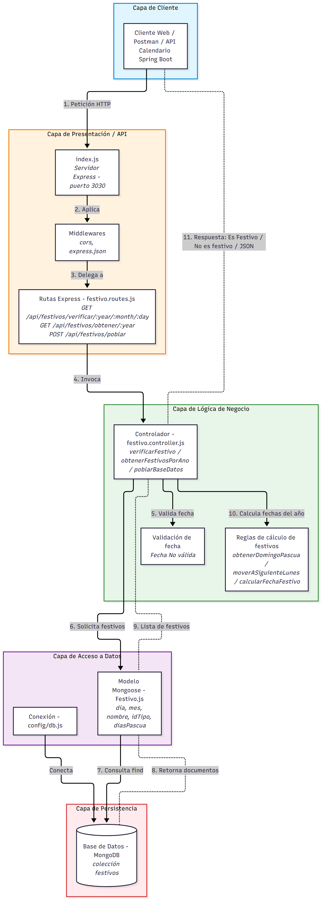
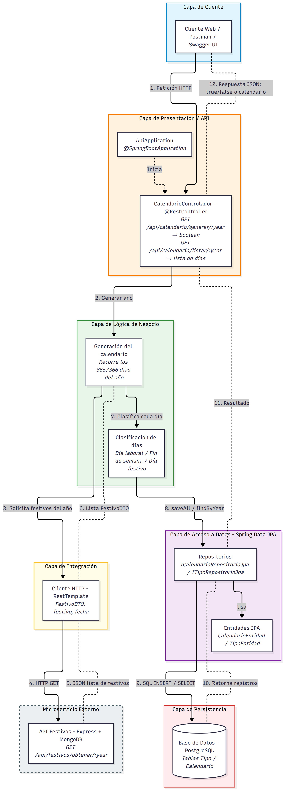
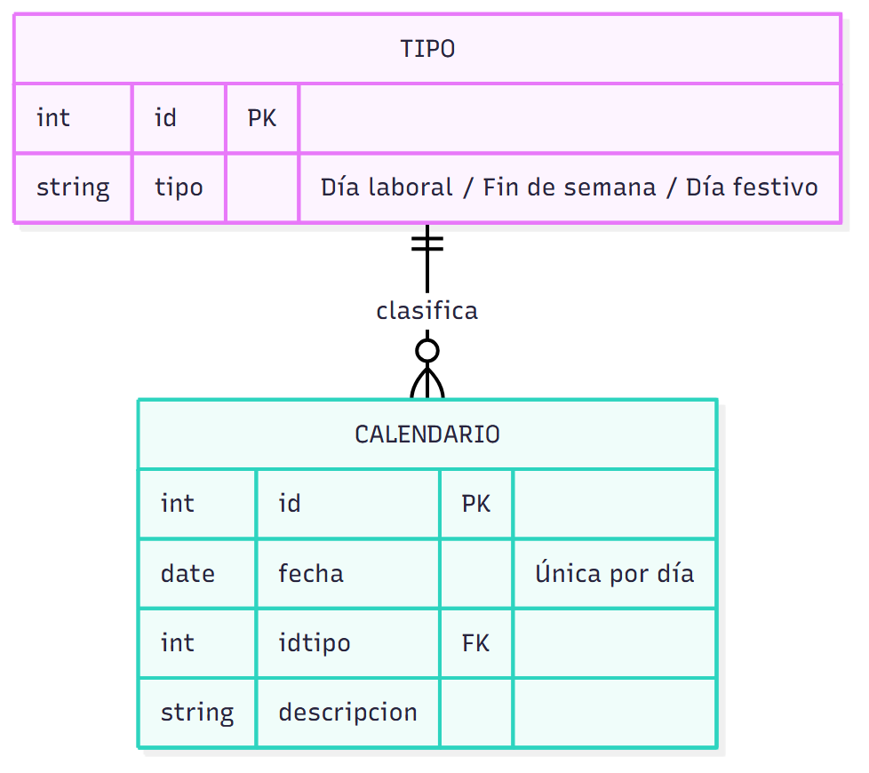
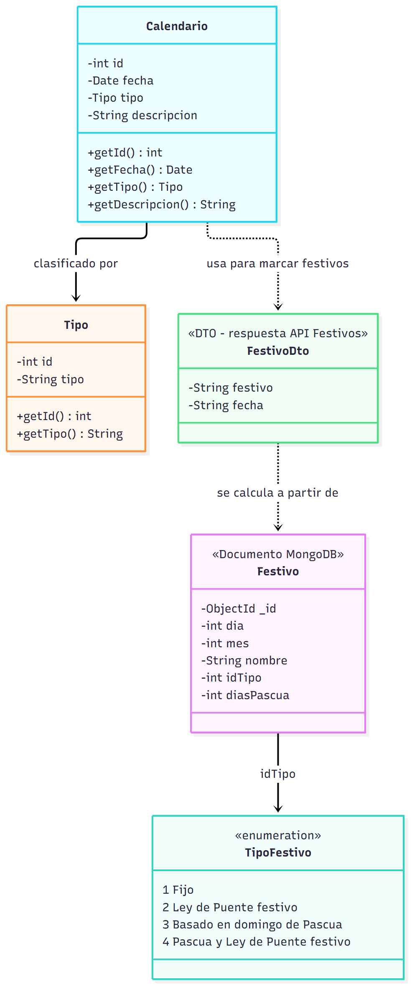

# Taller 1 - Arquitectura de Software (Microservicios)

Este repositorio contiene la solución al Taller 1: dos APIs RESTful que conforman una solución basada en microservicios.

| # | API | Tecnología | Carpeta |
|---|-----|------------|---------|
| 1 | API Festivos | Express JS + MongoDB | `/apiFestivos` |
| 2 | API Calendario (cliente de la API Festivos) | Spring Boot + PostgreSQL | `/apiMonedas` (módulo calendario) |

### Endpoints

**API Festivos** (`http://localhost:3030`)
- `GET /api/festivos/verificar/{año}/{mes}/{día}` → *Es Festivo* / *No es festivo* / *Fecha No válida*
- `GET /api/festivos/obtener/{año}` → lista de festivos del año

**API Calendario**
- `GET /api/calendario/generar/{año}` → genera y almacena todos los días del año clasificados (retorna `true`/`false`)
- `GET /api/calendario/listar/{año}` → retorna el calendario completo con los días clasificados

---

## 📐 Diagramas de Arquitectura (Mermaid)

### 1. Diagrama de Arquitectura por Capas - API Festivos (Express + MongoDB)

Código fuente: [`diagramas/festivos.mmd`](diagramas/festivos.mmd)

### 2. Diagrama de Arquitectura por Capas - API Calendario (Spring Boot + PostgreSQL)

Muestra la comunicación entre microservicios: la API Calendario consume vía HTTP GET la API Festivos.

Código fuente: [`diagramas/calendario.mmd`](diagramas/calendario.mmd)

---

## 💾 Modelado de Datos

### 3. Diagrama Relacional - BD Calendario (PostgreSQL)

### 4. Diagrama Objetual - Clases de ambas APIs

---

## 📝 Correcciones respecto a la primera entrega

- Se rehízo el diagrama de la API Festivos siguiendo el ejemplo de División Política (capa de cliente, flujo numerado de petición/respuesta, archivos y rutas reales, reglas de cálculo de Pascua y Ley de Puente).
- Se agregó el diagrama de la **API Calendario**, que no se había entregado (antes se había diagramado la API Monedas, que era solo el ejemplo del enunciado).
- Los diagramas relacional y objetual ahora corresponden a las APIs del taller (Festivos y Calendario) y no a Monedas.
- La versión en Arquitectura Cebolla (Onion) de la API Calendario se encuentra en la carpeta `examen2`.
