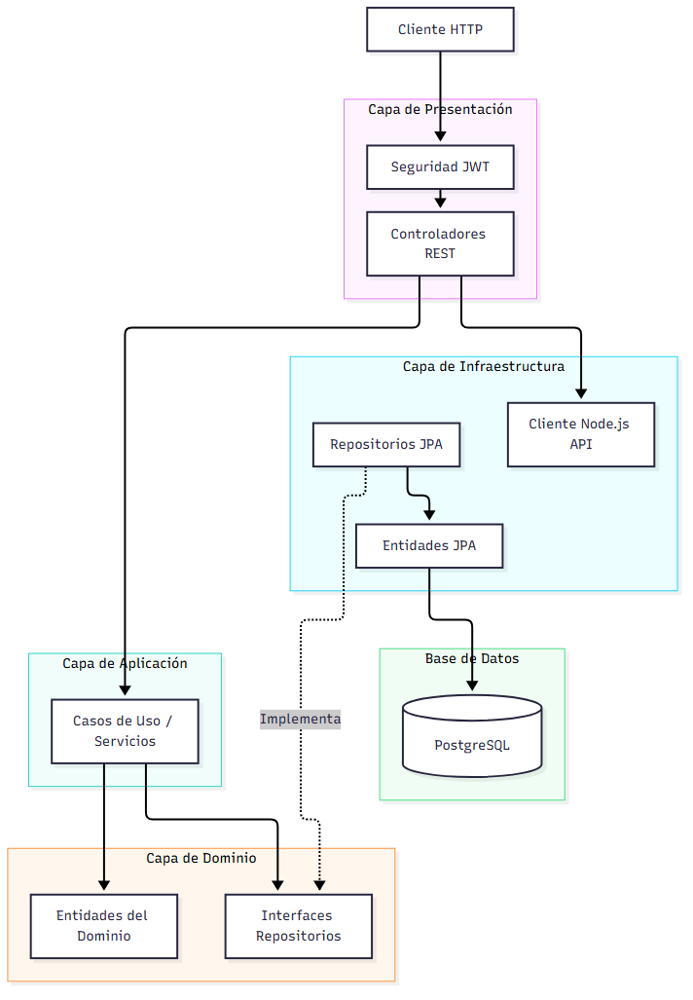

# Taller 1 - Integración de Sistemas

Este repositorio contiene la solución completa al Taller 1.

## 🚀 Fases Completadas

1. **Fase 1:** API Festivos (Node.js, Express, MongoDB) - Ruta: `/apiFestivos`
2. **Fase 2:** API Calendario (Spring Boot, PostgreSQL) - Ruta: `/apiMonedas` (Módulo Integrado)
3. **Fase 3:** API Monedas y Seguridad JWT (Spring Boot, PostgreSQL) - Ruta: `/apiMonedas`

---

## 📐 Fase 4: Diagramas de Arquitectura (Mermaid)

A continuación, se presentan los diagramas de arquitectura de las soluciones desarrolladas:

### 1. Diagrama de Arquitectura por Capas - API Festivos (Node.js)

### 2. Diagrama de Arquitectura por Capas - API Calendario y Monedas (Spring Boot)

La solución en Java implementa una **Arquitectura Hexagonal (Limpia)** separada por módulos:

---

## 💾 Fase Adicional: Modelado de Datos

Para asegurar una entrega perfecta (como la de tus compañeros), también se incluyeron los diagramas de Base de Datos y de Clases:

### 3. Diagrama Relacional (Base de Datos Monedas)

### 4. Diagrama Objetual (Clases del Dominio)

